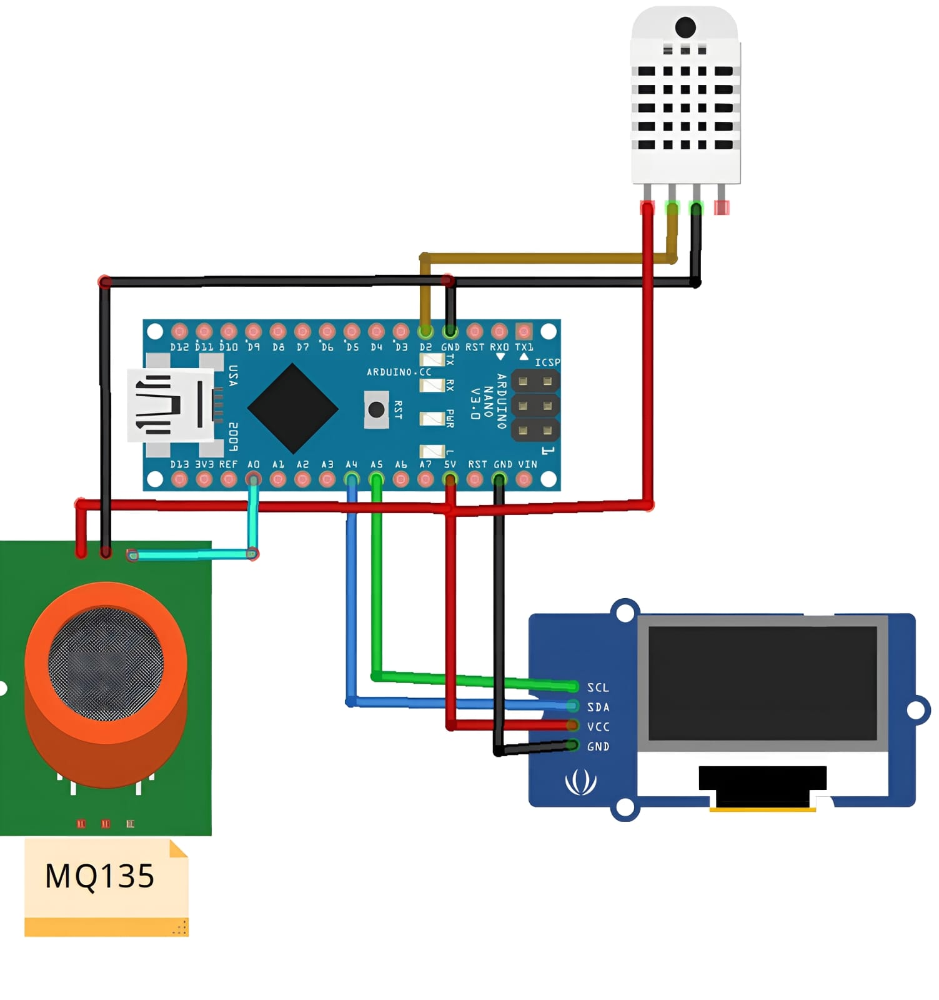

# 🌡️ Arduino Air Quality Monitor 🌿

A simple air quality monitoring system built with Arduino Nano that measures:
- 🌡️ Temperature using DHT11 sensor
- 💧 Humidity using DHT11 sensor
- 💨 Air quality using MQ135 gas sensor
- 📊 Displays readings on a 0.96" OLED display with custom fonts

*Final assembled air quality monitor*

## 📋 Components

- 1 × Arduino Nano R3
- 1 × DHT11 Temperature & Humidity Sensor (3 pins)
- 1 × 0.96" I2C OLED Display
- 1 × MQ135 Air Quality Sensor
- Jumper wires
- Breadboard

## 🔌 Wiring Instructions

### DHT11 Temperature & Humidity Sensor
- VCC → 5V on Arduino
- DATA → Digital Pin 2 on Arduino
- GND → GND on Arduino

### 0.96" I2C OLED Display
- VCC → 5V on Arduino
- GND → GND on Arduino
- SCL → A5 (SCL) on Arduino
- SDA → A4 (SDA) on Arduino

### MQ135 Air Quality Sensor
- VCC → 5V on Arduino
- GND → GND on Arduino
- AOUT → A0 on Arduino

### Complete Wiring Diagram

## 📚 Required Libraries

You'll need to install the following libraries through the Arduino Library Manager:

1. **Adafruit GFX Library** - For graphics rendering on the OLED
2. **Adafruit SSD1306** - For controlling the OLED display
3. **DHT sensor library by Adafruit** - For reading the DHT11 sensor
4. **SPI Library** (included with Arduino IDE) - For communication protocols

### 📥 How to Install Libraries

1. Open Arduino IDE
2. Go to **Sketch** > **Include Library** > **Manage Libraries...**
3. In the Library Manager search bar:
   - Type "Adafruit GFX" and install the latest version
   - Type "Adafruit SSD1306" and install the latest version
   - Type "DHT sensor library" and install the latest version

## 🎨 Display Features

The code includes custom fonts for a better display experience:
- FreeSans9pt7b
- FreeMonoOblique9pt7b

The display shows:
- 📊 Air quality status with descriptive labels
- 🌡️ Temperature in Celsius
- 💧 Relative humidity percentage

## 📈 Air Quality Thresholds

The MQ135 sensor uses the following thresholds:

- < 181: ✅ GOOD!
- 181-225: ⚠️ Poor!
- 225-300: 🔴 Very bad!
- 300-350: ☠️ ur dead!
- > 350: ☢️ Toxic

These thresholds are approximate and might need calibration for your specific environment.

## 🛠️ Step-by-Step Assembly Guide

### Step 1: Breadboard Setup
1. Place your Arduino Nano on the breadboard, ensuring each pin has its own row
2. Make sure to leave enough space for connecting other components

### Step 2: Connect Power and Ground
1. Connect the 5V pin of Arduino to the positive (+) rail on the breadboard
2. Connect the GND pin of Arduino to the negative (-) rail on the breadboard
3. Use red wires for 5V connections and black wires for GND connections for clarity

### Step 3: Connect the DHT11 Sensor
1. Place the DHT11 sensor on the breadboard
2. Connect the VCC pin to the positive rail (5V)
3. Connect the GND pin to the negative rail (GND)
4. Connect the DATA pin to digital pin 2 on the Arduino

### Step 4: Connect the OLED Display
1. Place the OLED display on the breadboard
2. Connect VCC to the positive rail (5V)
3. Connect GND to the negative rail (GND)
4. Connect SDA pin to A4 on the Arduino
5. Connect SCL pin to A5 on the Arduino

### Step 5: Connect the MQ135 Sensor
1. Place the MQ135 sensor on the breadboard
2. Connect VCC to the positive rail (5V)
3. Connect GND to the negative rail (GND)
4. Connect AOUT to analog pin A0 on the Arduino

### Step 6: Double-Check All Connections
1. Verify all power connections are correct (5V and GND)
2. Confirm that data pins are connected to the correct Arduino pins
3. Check for any loose connections or potential short circuits

## 💻 Programming Instructions

### Step 1: Download and Install Arduino IDE
1. If you haven't already, download the Arduino IDE from [arduino.cc](https://www.arduino.cc/en/software)
2. Follow the installation instructions for your operating system

### Step 2: Install Required Libraries
1. Open Arduino IDE
2. Install all required libraries as described in the Libraries section

### Step 3: Connect Arduino to Computer
1. Connect your Arduino Nano to your computer using a USB cable
2. In Arduino IDE, go to **Tools** > **Board** and select "Arduino Nano"
3. Go to **Tools** > **Processor** and select "ATmega328P"
4. Go to **Tools** > **Port** and select the COM port where your Arduino is connected

### Step 4: Upload the Code
1. Copy the air_quality_monitor.ino code into your Arduino IDE
2. Click the "Verify" button (✓) to compile the code
3. If compilation is successful, click the "Upload" button (→) to upload to your Arduino
4. Wait for the "Upload complete" message

## 🚀 Usage

1. Connect all components according to the wiring instructions
2. Install the required libraries
3. Upload the code to your Arduino Nano
4. Power your Arduino (via USB or external power supply)
5. The OLED display will immediately start showing sensor readings
6. Open the Serial Monitor (9600 baud) to view data output

## 📝 Understanding the Readings

### 🌡️ Temperature Reading
- Displayed in Celsius
- Normal room temperature is typically between 20-25°C
- DHT11 has an accuracy of ±2°C

### 💧 Humidity Reading
- Displayed as percentage (%)
- Comfortable indoor humidity is typically between 30-50%
- DHT11 has an accuracy of ±5%

### 💨 Air Quality Reading
- Raw analog value from MQ135 sensor (0-1023)
- Quality assessment based on predefined thresholds
- Lower values indicate better air quality

## ⚠️ Troubleshooting

### Display Not Working
- Check all OLED connections
- Verify correct I2C address (0x3C is default, might be 0x3D for some displays)
- Make sure the libraries are correctly installed

### Sensor Readings Showing Zero or Error
- Check sensor connections
- Verify power connections (5V and GND)
- Make sure the DHT11 sensor is correctly connected to digital pin 2

### Incorrect Air Quality Readings
- MQ135 needs warming up (24-48 hours for accurate readings)
- Calibrate the sensor in a clean air environment
- Adjust thresholds based on your specific environment

## 📌 Notes

- ⏱️ The MQ135 sensor needs a warm-up time of about 24-48 hours for most accurate readings
- 🔄 Temperature, humidity and air quality readings update every 2 seconds
- 📱 The display layout includes a title section and dedicated areas for each measurement
- 🔤 The code uses custom fonts for better readability on the small display
- 🔋 For portable use, you can power the Arduino with a battery pack or power bank

## 🔍 Future Enhancements

- 📲 Add Bluetooth connectivity to send data to a smartphone
- 📊 Implement data logging to track air quality over time
- 🌐 Add WiFi connectivity to upload data to cloud services
- 🔌 Include more sensors (CO2, particulate matter, etc.)
- 📦 Design a custom enclosure for a more polished look

---

*Note: Create a folder named "images" in your project directory and add the project_overview.jpg and complete_wiring.jpg images to it.*
 